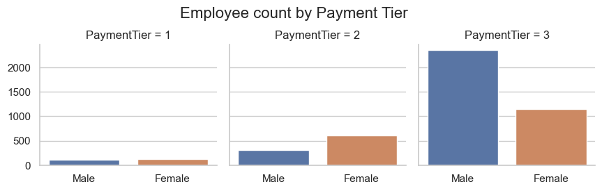
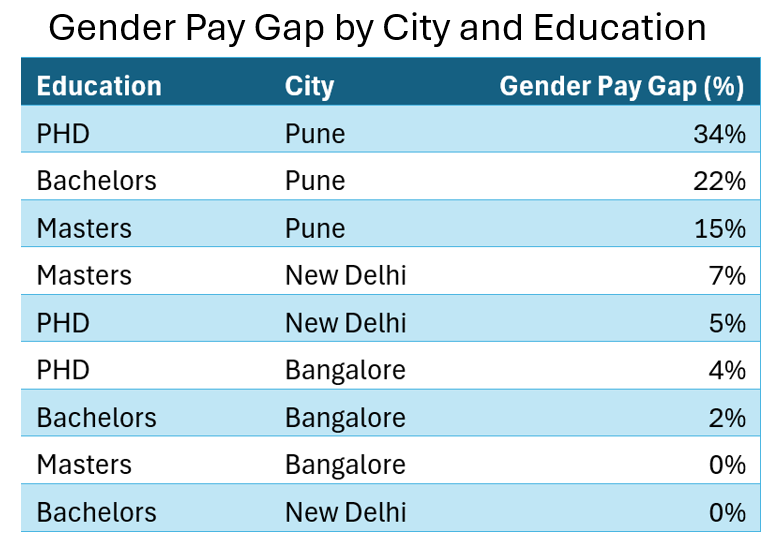

# ***Nexora Tech gender inequality analysis***

## *Project Overview*
This project examines employee data from Nexora Tech, a growing tech company based in India. Recently the company has had a high turnover of female staff, hence analysis into potential reasons why is warranted. Our primary objective is to understand the causes of high female employee turnover. Insights will ultimately support HR recruitment in ensuring equity of pay, promoting diversity in the work culture, and fostering an inclusive environment.   

## *Executive Summary*
To address high female staff turnover at the company, employee data regarding pay and demographics from 2012 to 2018 was explored and analysed. Female turnover is 4x greater than male turnover at the Pune branch, which could be due the 18% gender pay gap at the branch. The gender pay gap in Pune is particularly high for women with a bachelor’s degree (22%) and a PhD (34%). The average yearly difference in male and female new hires is 24%, leading to an overall decline in the number of women at the company. I recommend that HR and the Payroll team conduct a comprehensive audit of employees’ pay data in the Pune branch. This will give us insight into the source of the gender pay gap, allowing us to take steps to reduce this to comply with labour laws, improve female employee satisfaction, and help reduce female turnover.   

## *Data description*
Aggregated data taken from a yearly survey given to employees every between 2012 and 2018. It has 4653 rows for each employee, and 9 columns containing information about their educational background (categorical; Bachelor’s, Master’s, or PHD), joining year, City (categorical; Pune, Bangalore, or New Delhi), payment tier (categorical; one of three possible payment tiers), age, gender, whether the employee has been benched, level of experience in their domain, and whether they have left the organisation. It was originally used a machine learning dataset used to predict employee turnover but has been used to examine female turnover at the company. This data was already cleaned and processed by its author, and had no missing values.   

This is a publicly available dataset on Kaggle: https://shorturl.at/mBGSa

### *Insights*: new hires by gender show possible bias toward men in recruitment, promotion, and retention over time. 

-	2700 male & 1800 female employed over 6 years, an overall gender diversity ratio of 1.5:1 (60%: 40%)
-	In 2018, there was a 30% difference between the number of male and female new hires; the average difference over the last four years is 24%, especially in Bangalore (40%)
-	Turnover rate is greater for females than males (47%, 26%)
-	4x greater female turnover in Pune branch, negligible differences in New Delhi and Bangalore
-	2.5x greater turnover for women with a bachelor's degree than men with a bachelor's degree
-	No information regarding transgender individuals was collected   

### *Insights*: Gender pay gap 

-	Average gender pay gap from 2016 to 2018 is 12%, (2.8, 2.5, p < .001)
-	This is driven by a higher proportion of men at the company (85%) in the third payment category compared to women (60%). This is not present in payment tiers 1 and 2
-	Significantly lower pay for women (2.2) at the Pune branch than males (2.7) (p < .001), this is consistent over time
-	Especially high for those with a bachelor’s degree (22%) and a PhD (34%)
-	No data on bonus pay, weekly working hours, or hourly pay.   
 
   

   

   

## *Recommendations:*

**Over the last four years, average gender pay gap has been 12%, especially in the Pune branch**
-	I recommend HR and the Payroll team conduct a comprehensive audit of employees’ pay data, which will include analysis of more detailed pay data including base pay, bonus and overtime.
-	This will give insight into the source of gender pay gap in the Pune branch, which allowing the company to ensure employees are compensated correctly according to the law, which will allow use to enact changes to reduce.
-	Enacting changes based on the results of the audit will reduce the gender pay gap, improve female employee satisfaction, and help reduce female turnover   

**Over the last four years, 30% more male new hires were recruited than females**
-	To ensure a more equitable hiring process, I recommend HR recruitment pilot a blind recruitment process in the Bangalore branch which involves anonymising name, gender, and ethnicity data, to recruiters, and using standardised tests more often. 
-	Studies show blind recruitment leads to less biased recruitment practices
-	This will increase the number of female new hires, leading to a more inclusive work environment, encouraging longer average employee tenure
-	Follow-up evaluation of pilot study in six months, assess change in female new hires with relation to employee satisfaction and turnover   
 
## *Limitations*
-	There were no transgender individuals recorded, implying that this was not an option given to employees to report, biasing the results toward cisgender individuals
-	No data regarding actual pay was recorded, just payment tier, which leads to unspecific calculations regarding average pay and statistical tests that make less reliable conclusions 
-	This is also outdated data, as we are in 2024, hence the insights can not be applied to the current employees   

